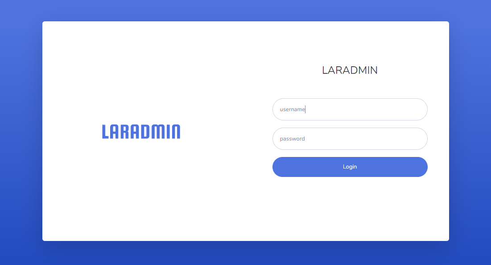
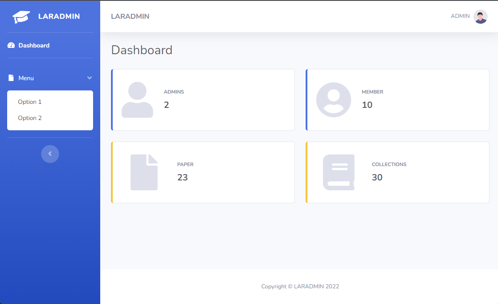

<p align="center">
    
    
</p>

<h1 align="center">Laradmin</h1>
<p align="center">Laradmin is a Admin Dashboard Template that can help you develop faster. We bring SB Admin 2 with Laravel starter project. It's completely free and you can use it in your projects.</p>

## Main Template
If you want to check the original template in StartBootstrap, [click here](https://startbootstrap.com/theme/sb-admin-2) to open template repository.

## Requirement
    - PHP 8
    - Composer
    - MySQL
    
## What's Include?
    - Laravel 9
    - Admin Midleware
    - Web Login / Logout
    - API Login / Logout

## Installation
1. Clone this project
    ```bash
    git clone https://github.com/gonexwind/laradmin
    cd laradmin
    ```

2. Install dependencies
    ```bash
    composer install
    composer fund
    ```

3. Set up Laravel configurations
    ```bash
    cp .env.example .env
    php artisan key:generate
    ```

4. Set your database in .env

5. Migrate database
    ```bash
    php artisan migrate --seed
    ```

6. Serve the application
    ```bash
    php artisan serve
    ```

7. Login credentials

**Username:** admin

**Password:** password

## Contributing
Feel free to contribute and make a pull request.